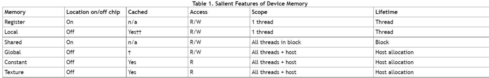

## 课程记录

### CPU
- 一般有三个部分：运算器（ALU），控制器，存储单元（内存缓存寄存器）
- 工作流程：取指，解码，执行，写回
    - CPU流水线：级数越高越好？不是，1.设计复杂，2.开销大，非满载不划算
    - 乱发序？

### GPU
- 108个SMs，

- 每个 SM 包括 4 个区块，使得每个 SM 可以并行执行 4 组不同指令序列(因为有4个warp调度器)。
- 每个区块有独立的 L0 指令缓存、Warp scheduler、dispatch unit（把线程分发到哪些计算资源中），16384 个 32 位寄存器.
    - Warp Scheduler（线程束调度器）：在NVIDIA的GPU架构中，一个Warp是由一组并行执行的线程组成的，通常包含32个线程。Warp Scheduler的任务就是管理和调度这些Warp。它负责选择哪个Warp应该在下一个时钟周期被执行，并且处理线程之间的依赖关系以及内存访问的冲突。Warp Scheduler也负责处理线程的分支和同步。
    - Dispatch Unit（派发单元）：Dispatch Unit的任务是将指令从Warp Scheduler发送到执行单元。当Warp Scheduler选择一个Warp进行执行时，Dispatch Unit会将该Warp的指令发送到相应的执行单元，如算术逻辑单元（ALU）或内存访问单元。
- 4 个区块共享 L1 指令缓存和数据缓存、shared memory
    - 指令缓存和数据缓存是分开的
    - 数据缓存和共享内存是公用的，但是AMDGPU到目前为止都是分开的

- SIMT：线程束中的每一个线程执行同一条指令，每个线程有自己私有的寄存器
    - 当一个warp中遇到了if的时候（线程发散），GPU会通过掩码执行（masked execution）的方式来处理，即记录状态，先执行满足if的停止不满足，当前者完成之后执行else部分
        - Volta架构之后，引入了independent thread scheduling从而缓解。
        - 在Volta架构及其后续架构中，每个线程都有自己的程序计数器和调用堆栈，这使得线程束中的线程可以独立地执行不同的指令。
    - 如果只有if但没有else，其实就不算是线程发散
    - 执行的线程叫做active threads

- 一个线程在一个cuda core中执行
- 一个block只能在一个SM中执行，一个SM可以有多个block

### GPU峰值算力
- PeakFLOPS = 频率 * SM个数 * 指令吞吐 * 2 
    - 2是因为指令吞吐是要做两个操作：加法和乘法

### GPU的内存层次结构
- 
- 寄存器一般最多255个，多了会被存到local mem中
- global:连续访问
- contant：有一个广播作用，一个线程读了，其他线程就不用再去global中去拿了

### CPU/GPU架构区别
- GPU控制单元更少       => GPU不适合处理有分支的程序
- GPU cache面积更小     => GPU不适合处理数据分散的程序
- GPU核心数量更多       => GPU不适合处理计算分散的程序
- GPU核心频率更低       => GPU不适合处理计算量小的程序
- GPU是标量运算处理器   => GPU不支持向量化计算，但支持向量化load & store

### Reduce
- reduce的优化思路
- 引入shared_mem
- 消除warp divergence
- 消除shared mem bank conflict
    - 什么叫back conflict
        - https://segmentfault.com/a/1190000007533157
        - 为了获得较高的内存带宽，共享存储器被划分为多个大小相等的存储器模块，称为bank，可以被同时访问。
        - 所谓的bank conflict就是一个warp中的线程访问同一个bank的不同word，此时就会产生冲突，当一个warp中的几个线程访问同一个bank中的相同字地址时，会广播数据给这些线程
        - 假设你有一个__shared__ float sdata[256];的数组，在大多数情况下（具体取决于你的GPU架构），这个数组会被分成32个banks，每个bank包含8个float元素。也就是说，sdata[0]、sdata[32]、sdata[64]等等会被分配到第一个bank，sdata[1]、sdata[33]、sdata[65]等等会被分配到第二个bank，以此类推。
        - 然而一个bank word的大小是32-bits，因此，对于float来说，访问相邻的数据就不会bank conflict，但是对于short/char这种16/8-bits的类型来说，其实相邻数据还是在一个bank之内
        
### warp level reduce
- Warp level primitive：warp内各thread间的寄存器可以相互访问。在这之前，warp内各thread只能通过shared memory来访问彼此的寄存器。
    - T __shfl_down_sync(unsigned mask, T var, unsigned int delta, int width=warpSize);
    - T __shfl_up_sync(unsigned mask, T var, unsigned int delta, int width=warpSize);
- 其加速来源主要是thread用的寄存器的访存速度远大于l1或者global mem
- 但是缺点就是这么玩不是每个core都在一个warp中计算

### NVCC编译的过程
#### Offline Compilation
- nvcc’s basic workflow consists in separating device code from host code
    - compiling the device code into an assembly form (PTX code) and/or binary form (cubin object)
    - 编译设备代码成汇编形式（PTX代码）和/或二进制形式（cubin对象），
    - and modifying the host code by replacing the <<<...>>> syntax introduced in Kernels (and described in more details in Execution Configuration) by the necessary CUDA runtime function calls to load and launch each compiled kernel from the PTX code and/or cubin object.
    - 修改主机代码，将在内核中引入的<<<...>>>语法（在执行配置中有更详细的描述）替换为加载和启动每个已编译内核所需的CUDA运行时函数调用。
- 修改后的主机代码可以输出为C++代码，由另一个工具编译，或者直接由nvcc在最后的编译阶段调用主机编译器生成对象代码。
- 应用程序可以：
    - 链接到已编译的主机代码（这是最常见的情况），
    - 或者忽略已修改的主机代码（如果有的话），并使用CUDA驱动程序API加载和执行PTX代码或cubin对象。

#### Just-in-Time Compilation
- 在运行时由应用程序加载的任何PTX代码都将由设备驱动程序进一步编译为二进制代码。这称为即时编译。即时编译会增加应用程序的加载时间，但允许应用程序从每个新设备驱动程序带来的任何新的编译器改进中受益。